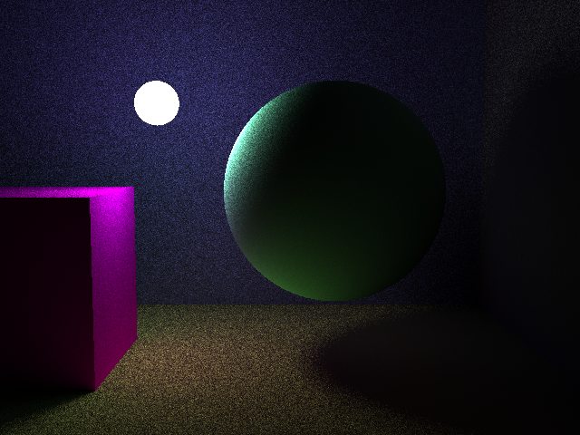
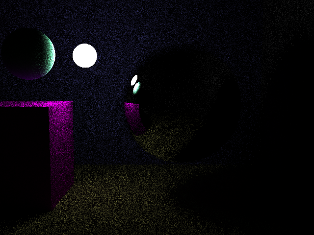

# rust-tracer

A simple multithreaded path-tracing ray tracer written in Rust.

## Features

- **Path Tracing** - Global illumination with Monte Carlo sampling for realistic soft lighting
- **Multithreaded Rendering** - Utilizes all CPU cores via Rayon for parallel pixel computation
- **Reflections** - Configurable reflectivity for mirror-like surfaces
- **Multiple Shapes** - Supports spheres, cuboids, and infinite planes
- **YAML Scene Files** - Define scenes in human-readable YAML format
- **Emissive Materials** - Objects can emit light for area lighting effects
- **Progress Bar** - Real-time rendering progress indicator
- **Flexible Output** - Supports PNG, JPEG, and other common image formats

## Installation

Ensure you have [Rust](https://www.rust-lang.org/tools/install) installed (1.56+ recommended).

```bash
git clone https://github.com/yourusername/rust-tracer.git
cd rust-tracer
cargo build --release
```

## Usage

```bash
cargo run --release <scene.yml> <output.png> [--dimensions=WIDTHxHEIGHT]
```

### Examples

```bash
# Render with default 640x480 resolution
cargo run --release example-scene.yml output.png

# Render at 1920x1080
cargo run --release example-scene.yml output.png --dimensions=1920x1080

# Render at 4K
cargo run --release example-scene.yml render.png -d 3840x2160
```

## Scene File Format

Scenes are defined in YAML with three main sections: `camera`, `shapes`, and `distant_lights`.

### Camera

```yaml
camera:
  cam_pos: [-1.0, 4.0, -8.0]      # Camera position [x, y, z]
  cam_orient: [0.0, -0.1, 1.0]   # Camera orientation/look direction
  up_vec: [0.0, 1.0, 0.0]        # Up vector (typically Y-up)
```

### Shapes

All shapes support these material properties:
- `color` - RGB values (0.0 to 1.0)
- `emissive_color` - Light emission RGB (values > 1.0 for brighter lights)
- `albedo` - Diffuse reflection coefficient (0.0 to 1.0)
- `reflectivity` - Mirror reflection (0.0 = matte, 1.0 = perfect mirror)

#### Sphere

```yaml
- type: Sphere
  centre: [0.0, 3.0, 8.0]
  r: 2.5
  color: [0.5, 1.0, 0.75]
  emissive_color: [0.0, 0.0, 0.0]
  albedo: 0.0
  reflectivity: 1.0
```

#### Cuboid

```yaml
- type: Cuboid
  position: [-7.0, 1.0, 8.0]
  bounds:
    - [-2.0, -2.0, -2.0]  # Min corner
    - [2.0, 2.0, 2.0]     # Max corner
  color: [1.0, 0.0, 1.0]
  emissive_color: [0.0, 0.0, 0.0]
  albedo: 1.0
  reflectivity: 0.0
```

#### Plane

```yaml
- type: Plane
  origin: [0.0, -1.0, 0.0]
  normal_vec: [0.0, 1.0, 0.0]
  color: [1.0, 1.0, 0.5]
  emissive_color: [0.0, 0.0, 0.0]
  albedo: 0.5
  reflectivity: 0.0
```

### Distant Lights

Directional lights for sun-like illumination:

```yaml
distant_lights:
  - direction: [0.5, -1.0, 0.3]
    intensity: 1.0
```

## Example Renders

Path tracing is computationally intensive. CPU rendering produces some noise, which can be reduced by increasing samples (at the cost of render time).





## Project Structure

```
rust-tracer/
├── src/
│   ├── main.rs              # CLI entry point
│   └── raytracer/
│       ├── mod.rs           # Module exports
│       ├── camera.rs        # Camera configuration
│       ├── ray.rs           # Ray representation
│       ├── scene.rs         # Scene rendering & path tracing
│       ├── intersection.rs  # Ray-shape intersection data
│       ├── distant_light.rs # Directional light source
│       ├── utils.rs         # Math utilities
│       └── shapes/
│           ├── mod.rs
│           ├── shape.rs     # Shape trait definition
│           ├── sphere.rs
│           ├── cuboid.rs
│           └── plane.rs
├── example-scene.yml        # Sample scene file
└── renders/                 # Example output images
```

## Dependencies

- [image](https://crates.io/crates/image) - Image encoding/decoding
- [nalgebra](https://crates.io/crates/nalgebra) - Linear algebra
- [rayon](https://crates.io/crates/rayon) - Parallel iteration
- [serde](https://crates.io/crates/serde) / [serde_yaml](https://crates.io/crates/serde_yaml) - YAML parsing
- [clap](https://crates.io/crates/clap) - Command-line argument parsing
- [indicatif](https://crates.io/crates/indicatif) - Progress bars
- [rand](https://crates.io/crates/rand) - Random number generation for Monte Carlo sampling

## License

MIT
